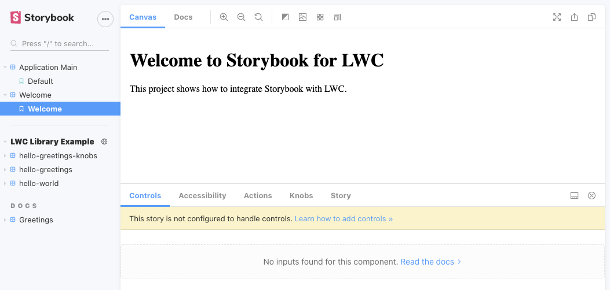

# LWC Storybook

## What is Storybook?
According to the documentation, [Documentation](https://storybook.js.org/), Storybook is a user interface development environment and playground for UI components. The tool enables developers to create components independently and showcase components interactively in an isolated development environment.  

The two deployed Storybook sites are available at the following URLs:
[https://lwc-essentials.github.io/storybook/](https://lwc-essentials.github.io/storybook/)




Github repo: [https://github.com/LWC-Essentials/storybook](https://github.com/LWC-Essentials/storybook)


## About
This project offers a sample LWC application, with a library, that shows how to integrate with Storybook. It covers different aspects of Storybook:  

- Component showcase  
  Shows the components in action in a dedicated, simple UI (stories).  
- Component documentation  
  Provide the full components documentation, which can be generated out of the components' source code and/or manually written.  
- Composition  
  The application Storybook aggregates the components provided by its dependencies (the library).  
- Static deployment  
  The resulting Storybook instance is deployed to a static server, typically on Github pages, so it becomes easily available.  
- Others  
  There are much more capabilities, like testing, accessibility reporting, ...
  

## Demo project layout
This project is a mono repo, powered by lerna, which currently contains two packages:  

- A reusable library of components, `lwc-library`  
- An application, `lwc-app`, consuming the library  

The demo is based on Storybook version 6.0+ version which implements the composition mechanism, and thus allows the main app to render the stories coming from the library.


## Getting started

The sample application is itself very basic, and not that exciting, but you can execute it with the following commands:  

```sh
yarn
yarn build 
yarn start
```

More interesting are the Storybooks.  
You can execute the library one, only showing the stories part of the library:  

```sh
cd packages/lwc-library/
yarn storybook
```

Or you can execute it from the application, which will include both the library and the application stories:  

```sh
cd packages/lwc-app/
yarn storybook
```

Note: in order for the composition to work, the library's Storybook must be deployed as a static site (see below for the instructions).


### Project commands
A series of commands is defined for each project (application and library) within `package.json`.  

In development mode, starting Storybook is done with the following commands:

- `storybook`
  Generate all the metadata files, compile the LWC components and run the development server.  
  This is the command to use at least when running Storybook for the first time. Going forward, and depending on what changes were made to the project, more optimized commands can be used (see; package.json).  

  
There are also some root commands to deploy the static site to Github Pages.  

- `build-static`
  Build the the static site, including the generation of `stories.json`, for both the application and the library.  
- `deploy-static`
  Deploy the static site built above to Github pages


## Projects Setup

### Application bundler
Storybook is using Webpack as the application bundler. Unfortunately, LWC is generally using Rollup and there is currently no supported Webpack plugin. As a result, we'll use Rollup to build the components and Webpack to build Storybook. This has several consequences:  

- There are 2 build steps, one for the components and one for Storybook itself  
  The `.storybook/` folder contains a rollup configuration that is used to compile the LWC components. The result is a single JavaScript file, generated to `.storybook/build`, referenced and loaded by Webpack.  
- The components displayed as part of a story must be custom elements.  
  All exposed LWC components should be registered as custom elements. In practice, this should not be an issue as naming conflicts between libraries should be very rare.


### Storybook folders
Both the library (`lwc-library`) and the application (`lwc-app`) feature 2 Storybook related directories:  

- `.storybook`  
  Contains the Storybook configuration files (`main.js`, `preview.js`...) as well as the LWC files needed for Storybook, like the rollup configuration.  
- `.stories`  
  Contains all the stories, for all the components. After several discussions, we decided to isolate the stories in their own folder rather than co-locating them with the components. It makes it easier for a developer to find the stories when working on them.  
  Note that this folder also contains an `index.js` file that references and registers all the components as custom elements. This is the entry point for the Rollup build.


### Composition
The main application is exposing its own stories as well as the stories defined in the library. For that, it uses the [Composition](https://medium.com/storybookjs/storybook-composition-af0da9084fba) mechanism. To enable composition, the library must be deployed as a static site with a properly generated `stories.json` file. Then, the application can either explicitly include it (see: `main.js - refs`) or implicitly if the library it includes features an entry in its `package.json` (automatic loading). This sample project uses the later, which makes it trivial to use.


## Implementing Storybook

### Creating a story for a component
As there is no dedicated LWC support in Storybook, this project uses the generic Web Component integration. As such, all the components that are exposed within the stories must be registered as custom elements. This is done in `/stories/index.js`.  
Stories use the [CSF](https://storybook.js.org/docs/formats/component-story-format/) format, using the `html` tag from [LitElement](https://lit-element.polymer-project.org/guide/templates) when including the markup. Omitting the tag could change the rendering, and limit how attributes/properties are passed to the components.  

Here is an example:  

``` js
import { html } from 'lit-html';
export const default_ = () => html`
    <hello-greetings></hello-greetings>
`;
```

### Documenting Web Components
Documentation which is a great strengh of Storybook, can be at least partially generated. The WebComponent organization comes with a meta-data format to desbribe web components: [custom-elements.json](https://github.com/webcomponents/custom-elements-json). Warning: this format is not yet a standard and can evolve in the near future. It currently contains enough information to describe a component, its attributes, properties, events, CSS variables...  

Writing or maintaining such a file manually is cumbersome, so we better generate it from the component source files. This task is achieved by a third party library: [web-component-analyzer](https://github.com/runem/web-component-analyzer#readme). As Javascript doesn't describe all the metadata that we need, the source code must be enriched with [JSDoc](https://jsdoc.app/) information. In particular, web-component-analyzer supports a set of web components specific tags describes [here](https://www.npmjs.com/package/web-component-analyzer#%E2%9E%A4-how-to-document-your-components-using-jsdoc). 

In order for web components to be recognized by web-component-analyzer, it currently must feature an element tag in its header. Moreover, the attributes, properties, ... should be property taggesd as well:  

```js
/**
 * LWC Component taggeg with JSDoc comments.
 * @element my-component
 */
export default class MyComponent extends LightningElement {
    /**
     * name is an attribute
     * @attr
     */
    @api name = ''
    /**
     * message is a property
     * @ property
     */
    message = ''
    
    ...
}
```

#### Generating documentation files
`web-component-analyzer` can also generate a markdown file describing the full list of components.  To experiment it, run:  
```sh
yarn storybook:meta-doc
```
The resulting documentation file is generated in the `.stories/build` folder.


### Story types
This sample application shows different story types.  

#### Component story
Component stories are defined using the [CSF](https://storybook.js.org/docs/formats/component-story-format/) format within `xxx.stories.js` files. Simply add the file to the `/stories` folder in the project root, or one of its subdirectories. Storybook is configured to automatically load all of them.

Make sure that the HTML markup uses the [LitElement](https://lit-element.polymer-project.org/guide/templates) `html` tag.  

Here is an example: [https://github.com/LWC-Essentials/storybook/blob/master/packages/lwc-library/stories/hello-greetings.stories.js](https://github.com/LWC-Essentials/storybook/blob/master/packages/lwc-library/stories/hello-greetings.stories.js).  

#### Documentation story
Storybook also uses [MDX](https://storybook.js.org/docs/formats/mdx-syntax/) files to provide a customizable documentation for the components. An MDX file contains a mix of markdown and React JSX. Documentation stories are defined within `xxx.stories.mdx` files that are also automatically loaded. Similarly to the component stories, it uses the LitElement `html` tag for the component markup.  

Here is an example: [https://github.com/LWC-Essentials/storybook/blob/master/packages/lwc-library/stories/doc-greetings.stories.mdx](https://github.com/LWC-Essentials/storybook/blob/master/packages/lwc-library/stories/doc-greetings.stories.mdx).  

#### Static content
Without creating the documentation, a static story only displaying content can easily be created using HTML.  

Here is an example: [https://github.com/LWC-Essentials/storybook/blob/master/packages/lwc-app/stories/welcome.stories.js](https://github.com/LWC-Essentials/storybook/blob/master/packages/lwc-app/stories/welcome.stories.js).  

#### Interacting with the components
The project shows how to display component attributes & properties using [Controls](https://github.com/storybookjs/storybook/blob/next/addons/controls/README.md#writing-stories). The stories for the `hello-greetings` demonstrate different variations.  
Note that [Knobs](https://github.com/storybookjs/storybook/tree/master/addons/knobs) are still supported but deprecated. One should use Controls instead.

See this example: [https://github.com/LWC-Essentials/storybook/blob/master/packages/lwc-library/stories/hello-greetings.stories.js](https://github.com/LWC-Essentials/storybook/blob/master/packages/lwc-library/stories/hello-greetings.stories.js)


### Developer experience
One of the value of Storybook is the component development experience, where code changea are reflected automatically in the Storybook UI. For this, Storybook relies on Webpack watchers. But this is not sufficient as the components are built using Rollup. Rollup is thus started with its own watchers to rebuild when a component is changed. Then Webpack watches the changes to the Rollup built file and rebuilds itself.  

As both Webpack and Rollup have watchers, the 2 processes must run in parallel. To make this reliable, we use [npm-run-all](https://www.npmjs.com/package/npm-run-all) instead of the simple `&` operator when launching processes. This better manages the termination of the background processes.  


### Deploying the static sites
The sites are deployed by default to Gihub pages, using using [gh-pages](https://www.npmjs.com/package/gh-pages). An easy solution would use [storybook-deployer](https://github.com/storybookjs/storybook-deployer), but is is less flexible in particular when deploying multiple Storybook sites from a mono repo.  

Deploying the static sites involves the following commands from the project root:

```sh
yarn build-static
yarn deploy-static
```

## LWC Specific

### Complex properties
LWC components can consume complex property values, like objects. Unfortunately, the custom element specification does not allow such values to ba passed through HTML markup.  

There are multiple solutions: 

- Use LitElement template syntax  
  The `html` syntax allows properties to be passed as any value when the its name starts with a dot `.`. Here is an example, where the time is passed as an object:  
  
  ```
  export const staticTime = () => html`
    <hello-time .time=${{hours:1,minutes:3,seconds:4}}></hello-time>
  `;
  ```

- Create a technical Web Component that wraps the desired one, and pass it complex parameters via the template  
  The library demo defines these components in the `wc` namespace located in `stories`. Note that the syntax above should be preferred in most cases, as it is simpler. Such a wrapper can be useful when an LWC template is required, for example when dealing with slots without Shadow DOM.  


### Provided add-ons
The sample app configures a set of add-ons

- [@storybook/addon-docs](https://www.npmjs.com/package/@storybook/addon-docs)  
   Docs transforms your Storybook stories into world-class component documentation.
- [@storybook/addon-knobs](https://www.npmjs.com/package/@storybook/addon-knobs)  
  Knobs allow you to edit props dynamically using the Storybook UI.  
- [@storybook/addon-a11y](https://www.npmjs.com/package/@storybook/addon-a11y)  
  Check the accessibility of a component. It shows any potential issue in a panel.  
- [@storybook/addon-storysource](https://www.npmjs.com/package/@storybook/addon-storysource)  
  Storysource show stories source in the addon panel
- [@storybook/addon-actions](https://www.npmjs.com/package/@storybook/addon-actions)  
  Display data received by event handlers.  
- [@storybook/addon-controls](https://www.npmjs.com/package/@storybook/addon-controls)  
  Controls gives you UI to interact with a component's inputs dynamically, without needing to code.    
- [@storybook/addon-events](https://www.npmjs.com/package/@storybook/addon-events)  
  Events allows you to add events for your stories.    
- [@storybook/addon-jest](https://www.npmjs.com/package/@storybook/addon-jest)  
  Brings Jest results in storybook.
- [@storybook/addon-viewport](https://www.npmjs.com/package/@storybook/addon-viewport)  
  Viewport allows your stories to be displayed in different sizes and layouts in Storybook.
- [@storybook/addon-backgrounds](https://www.npmjs.com/package/@storybook/addon-backgrounds)  
  Let a user change the background color within the preview window.  
- [@storybook/addon-storyshots](https://www.npmjs.com/package/@storybook/addon-storyshots)  
  StoryShots adds automatic Jest Snapshot Testing for Storybook.
- [@storybook/addon-links](https://www.npmjs.com/package/@storybook/addon-links)  
  Links can be used to create links that navigate between stories in Storybook.

The WebComponent organization is also coming with extra add-ons, like [storybook-addon-web-components-knobs](https://www.npmjs.com/package/storybook-addon-web-components-knobs), but they have not been integrated with this sample project yet.


## TODOs
Yes there are TODOs...  

- Decrease the build time  
  One solution is to provide a prebuilt-version of Storybook, see: [https://github.com/open-wc/storybook-prebuilt](https://github.com/open-wc/storybook-prebuilt)
  
- Use the LWC compiler to extract meta-data  
  The Stencil compiler provides such a feature, although it missed some of the meta-data. The LWC has an RFC for a canonical meta-data format: [https://github.com/salesforce/lwc-rfcs/pull/33/files?short_path=2648c38#diff-2648c38fced96da2e0c183fd293d54eb](https://github.com/salesforce/lwc-rfcs/pull/33/files?short_path=2648c38#diff-2648c38fced96da2e0c183fd293d54eb).  
  
- Extend web-component-analyzer to better support LWC  
  [https://github.com/runem/web-component-analyzer/issues/150 ](https://github.com/runem/web-component-analyzer/issues/150)
  - Scan the lwc.config.json to enumerate the components
  - Deduce the element name from the directory of a component
  - Handle @api and other decorators  
  - ...

